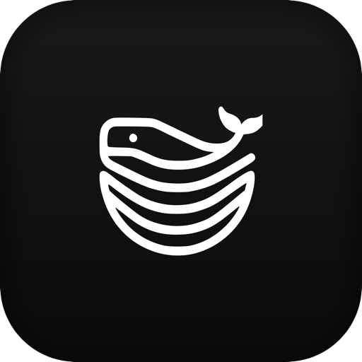
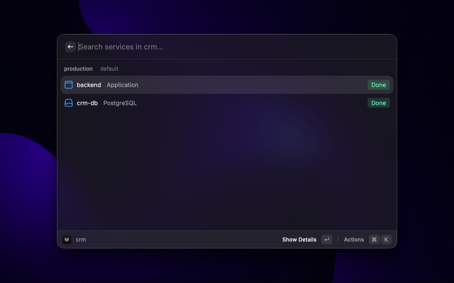
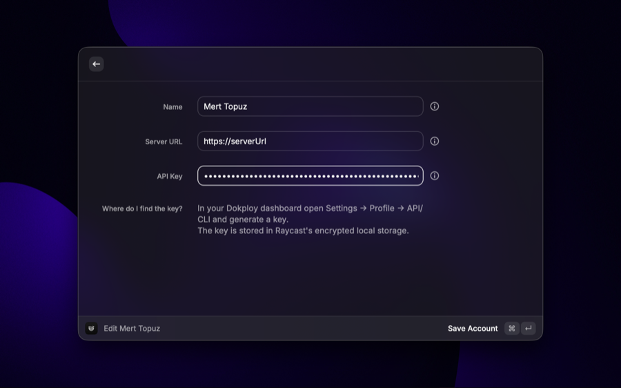
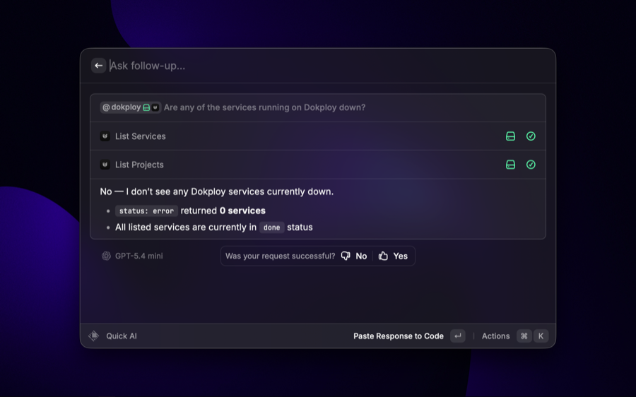

  

<h1 align="center">Dokploy Manager for Raycast</h1>

  Manage your <a href="https://dokploy.com">Dokploy</a> servers without leaving Raycast.

  <b>English</b> ·
  <a href="README.tr.md">Türkçe</a>

  <a href="#getting-started">Getting started</a> ·
  <a href="#commands">Commands</a> ·
  <a href="#ask-raycast-ai">Raycast AI</a> ·
  <a href="#your-data">Your data</a>

  

Browse your projects, deploy and restart services, read logs, and find out why a build failed - all from the Raycast window. Connect as many Dokploy servers as you like and switch between them in a keystroke.

## Getting started

1. Open your Dokploy dashboard and go to **Settings → Profile → API/CLI**, then generate an API key.
2. In Raycast, run **Manage Accounts**, and add your server address together with that key.

  

That's it. Your key is checked against the server as you save it, so if something is wrong you'll know straight away rather than the next time you try to deploy.

Have more than one server? Add them all. Most commands act on the account you've marked as active, which you can change from **Manage Accounts** or from the dropdown in the search bar.

## Commands

**Browse Projects** - Walk through your projects and environments and act on any service inside them: applications, Docker Compose stacks, and PostgreSQL, MySQL, MariaDB, MongoDB, Redis and LibSQL databases. Create a project with `⌘N`, delete one with `⌃X`.

**Search Services** - Every service on the server in one searchable list, when you know the name and don't want to click through projects.

**Deploy** - Type the command, type a service name, press Enter. No window opens: it's the shortest path from Raycast's root search to a redeploy. Names are matched the same way the AI matches them, so an ambiguous name asks which one you meant rather than guessing.

**Recent Deployments** - What was deployed lately, whether it worked, and the build log when it didn't. You can also kill a build that's stuck, cancel one that's queued, or roll back to an earlier build.

**Deploy Template** - Dokploy ships hundreds of ready-made Compose stacks: n8n, Plausible, Uptime Kuma, Supabase and the rest. Search them by name or by tag, then pick a project and environment and install one without touching the dashboard.

Press `⌘D` on any template to see what it will actually create before you commit to it: the domains it wants, the environment it sets, the config files it writes, and which values Dokploy will generate for you at install time. The Compose file itself is a keystroke further. Templates you keep coming back to can be bookmarked with `⌘B`, and they rise to their own section at the top of the list.

**Service Status** - A menu-bar item that keeps an eye on everything. It turns red the moment a service fails, so you find out without going looking. Deploy or restart anything from the menu, or jump into its deployments.

It watches the server itself too, not just the services on it: disk, CPU and memory per instance, and Docker's own disk footprint. A Dokploy server dies of a full disk more often than of anything else, and unlike a failed service it warns you in advance - so the icon goes red for that as well, and Docker's prune commands are in the same menu to do something about it. Pruning images or stopped containers only throws away rebuildable artifacts; pruning volumes throws away data, and is the one that asks twice.

**Manage Accounts** - Add, edit, remove and switch between your Dokploy servers.

Projects and services put themselves in the order you actually use them: the service you deploy every day drifts to the top of the list, and the one you touched once in March sinks. If that ever guesses wrong, **Reset Ranking** puts an item back where it started.

## What you can do to a service

Deploy, redeploy, start, stop, reload and delete - plus read its logs, manage its domains, run its backups and schedules, and open it in the Dokploy dashboard. Databases can be rebuilt instead of redeployed, matching what Dokploy itself offers for each kind of service.

Anything that takes a service down asks you to confirm first.

### Logs

`⌘L` opens a service's logs. `⌘F` follows them, so new lines arrive while you watch instead of on the next refresh.

A Compose stack runs several containers and Dokploy reads one at a time, so `⌘T` switches between them. The running one is picked for you.

### Domains

`⌘⇧U` on an application or a Compose stack lists its domains, opens one in the browser, and adds or removes them.

Adding one is the part worth knowing about. `⌘G` generates a domain that already resolves to your server, which is the fastest way to get a stack reachable when you don't have DNS ready. If you're bringing your own host, `⌘T` checks that it points at this server before you save, rather than after Traefik fails to route it. HTTPS asks which certificate to issue; the service needs a redeploy for it to take effect, and the toast says so.

### Backups

`⌘⇧B` shows the backups configured for a Compose stack or a Postgres, MySQL, MariaDB, MongoDB or LibSQL database, when each last ran, and whether it worked. Press Enter to run one now without waiting for its cron.

Configuring a backup means configuring an S3 destination, which Dokploy only lets owners and admins do, so that part stays in the dashboard. Running one is the question worth asking from Raycast.

### Schedules

`⌘⇧T` lists the cron commands attached to an application or a Compose stack and runs one on demand. Each run is recorded as a deployment, so you can read what the command actually printed. Dokploy keeps the last ten.

### Environment variables

Any service's variables are one keystroke away (`⌘⇧E`), and editable in place. Values are masked until you press **Reveal Values**, because reading your own environment on your own machine isn't the risk - doing it while screen-sharing is, and that's exactly when you reach for Raycast. Build arguments and build secrets are there too, for the services that have them.

Saving stores the variables but doesn't restart anything, the same as Dokploy itself: redeploy the service when you want them to take effect.

### Database connection strings

Postgres, MySQL, MariaDB, MongoDB, Redis and LibSQL each hand you a connection string straight to the clipboard:

- **External** (`⌘⇧U`) - the one you paste into TablePlus or `psql` on your laptop. Only exists once the database has an external port; if it doesn't have one, the extension says so rather than copying something that can't connect.
- **Internal** (`⌘⌥U`) - the one you paste into another service's environment variables, reaching the database over Dokploy's own network.

These are built to match what the Dokploy dashboard shows for each kind of database, quirks and all. Connection strings and passwords are copied as concealed, so they don't linger in Raycast's clipboard history.

## Ask Raycast AI

The extension works with Raycast AI, so you can just say what you want:

- "is anything down on Dokploy?"
- "why did the last deploy of the api fail?"
- "redeploy the storefront backend"
- "show me the last 50 log lines from the worker"

  

Before anything is deployed, started, stopped or restarted, Raycast shows you exactly what is about to happen and waits for your approval. Deleting a service is not something the AI can do at all.

If a name is ambiguous - say two projects both have a service called `api` - you'll be asked which one you meant rather than have one picked for you.

## Settings

- **Log Lines** - how much of a log to fetch when you open one. Defaults to 200; Dokploy allows at most 10000.
- **Watch** (Service Status) - whether the menu bar keeps an eye on every server you've connected or only the active one. Defaults to all of them.
- **Disk Warning** (Service Status) - how full a server's disk has to get before the menu bar calls it a problem. Defaults to 90%. Dokploy carries its own CPU and memory thresholds but has none for disk, so this is the one number the extension has to ask for. Needs Dokploy's monitoring enabled.

## Your data

This extension talks to your own Dokploy server. There is no analytics, and nothing is sent anywhere else - with one exception, which is worth being precise about.

**Deploy Template** reads from Dokploy's public template registry at `templates.dokploy.com`, not from your server: each template's logo, and, when you open a template's details, its `template.toml` and Compose file. There is no route on your own server that serves those, so the registry is the only source - it's the same public catalogue your Dokploy server itself fetches. That host sees your IP address like any website you visit. Nothing about your server, your projects or your key is sent with those requests, and no other command touches it. If you never open **Deploy Template**, the extension only ever talks to your own server.

Your API keys are kept in Raycast's encrypted local storage, and never leave your machine except to sign requests to your own server. Environment variables, build secrets and database passwords are never shown to Raycast AI.

Secrets are also never written to disk. Raycast caches command results so lists open instantly, but that cache isn't encrypted - so environment variables and database credentials are fetched only when you ask to see them, kept in memory, and left out of the cache entirely. That's also why a database's credentials are read at the moment you copy them rather than when the list is drawn. Server health is cached, because the monitoring token stays behind and only the readings come back.

One thing worth knowing before you use the AI commands: whatever the AI reads on your behalf gets sent to Raycast AI so the model can answer you - including **log contents**, if you ask about them. Logs are your application's raw output, so if your app prints tokens or personal data, that goes along too. When that matters, use the regular commands instead, which keep everything on your machine.

## License

MIT
